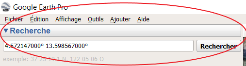
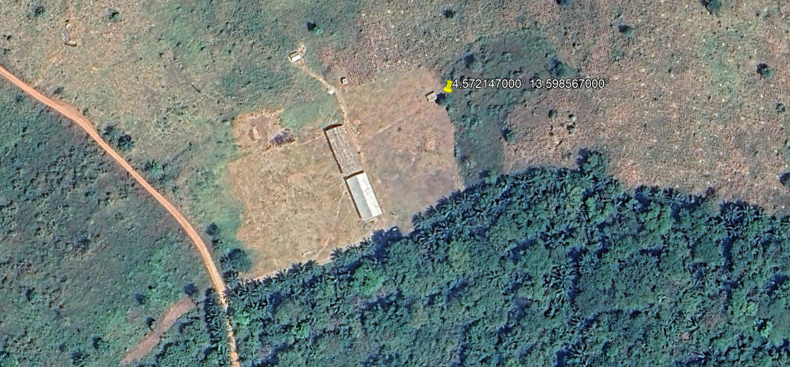
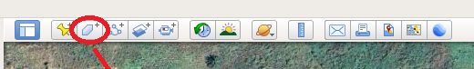
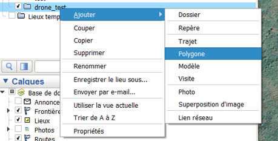
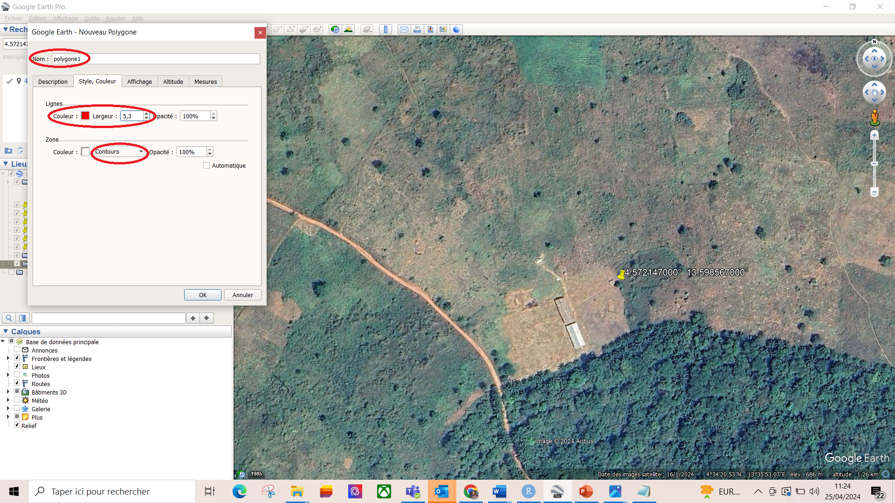
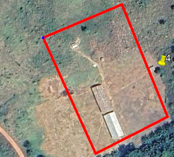
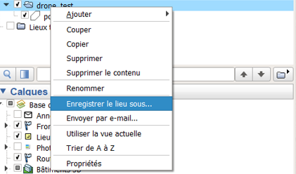
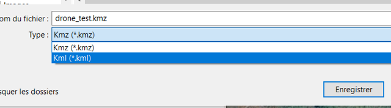

# Pratique Logiciel et Drone {#Pratique-Logiciel-et-Drone}

On commence par localiser l'endroit qu'on souhaite cartogarhier ou l'endroit ou l'on souhaite intervenir

## Google earth pro

Google Earth Pro est utilisé pour l'exploration géographique, la **planification**, la visualisation de données et la création de contenu visuel pour diverses applications professionnelles et personnelles. Dans notre cas nous l'utilisons pour plannifier et déterminer la zone que le drone va couvrir.

1.   Mettre les coordonnées ou photo ou nom de la zone à cartographier ou a parcourir par drone dans la zone recherche. par exemple **4.572147000°** et **13.598567000°** qui représente respectivement les latitudes et longitudes de la zone. Vous verrez par la suite une image de la zone avec 2 classes

```{r echo=FALSE,  out.width = '45%',fig.show='hold', fig.height=6}


```


2.  Tracez un polygone pour délimiter la zone que le drone couvrira. Pour cela, vous pouvez sélectionner l'onglet "Polygone" ou faire un clic droit sur le dossier, puis choisir "Ajouter" et sélectionner "Polygone".. 

```{r echo=FALSE,  out.width = '45%',fig.show='hold', fig.height=6}


```

3.  Après avoir slectionné le polygone un onglet s'ouvre. Avant de cliquer sur "Ok", assurez-vous de donner un nom au polygone, de personnaliser sa couleur,son épaisseur et son type, puis de tracer le polygone. 

```{r echo=FALSE,  out.width = '45%',fig.show='hold', fig.height=6}


```

4. Exportation du fichier. Celui-ci représentera la trajectoire que le drone suivra. Pour exporter le fichier, faites un clic droit sur le dossier, puis cliquez sur "Enregistrer le lieu sous". Une fenêtre s'ouvrira et vous donnera le choix de sauvegarder le fichier au format KMZ ou KML. Il est recommandé de choisir le format KML car il est largement pris en charge par la plupart des sites web et applications, contrairement au format KMZ, qui peut ne pas fonctionner dans certains cas.

```{r echo=FALSE,  out.width = '45%',fig.show='hold', fig.height=6}


```

## Dronelink
Dronelink est disponible en ligne et sur les smartphones. La planification des missions commence généralement sur le site web, où vous pouvez créer des itinéraires détaillés pour le drone. Ensuite, vous utilisez l'application mobile pour exécuter ces missions et contrôler le drone pendant le vol.

Le site web [**https://app.dronelink.com/**](https://app.dronelink.com/) est une plateforme dédiée à la planification de vols de drones. Elle permet aux utilisateurs de créer des missions de vol, de définir des trajectoires spécifiques, et de paramétrer différents aspects du vol, tels que l'altitude, la vitesse, les points de passage (waypoints), et d'autres actions que le drone doit effectuer. Les utilisateurs peuvent également simuler des vols pour voir comment le drone se comportera selon le plan établi. Dronelink est souvent utilisé par des professionnels de l'industrie des drones, comme les photographes aériens, les ingénieurs en inspection, ou les spécialistes de la cartographie, pour préparer des missions précises et automatisées.

1. Commencez par vous connecter au site web en utilisant votre nom d'utilisateur ou votre adresse e-mail, ainsi que votre mot de passe. Remarque : pour un accès illimité au site web, des frais d'environ 110 $ sont requis. Pour les membres dédiés du personnel du PAM au Cameroun souhaitant obtenir un accès au site web, veuillez contacter [**Idrissa Dabo**](idrissa.dabo@wfp.org) ou [**Cedric Matsaguim**](cedric.matsaguim@wfp.org) pour vous connecter au projet PAM Cameroun.

2. Résumé de la manière de créer un projet et de déterminer l'itinéraire du drone dans dronelink
